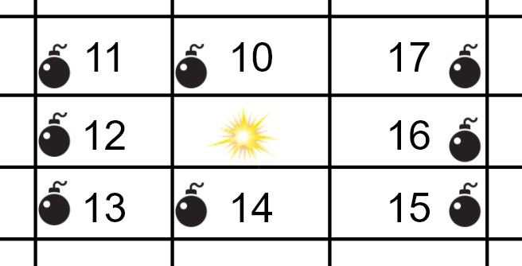
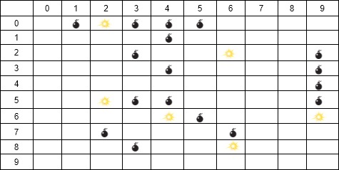
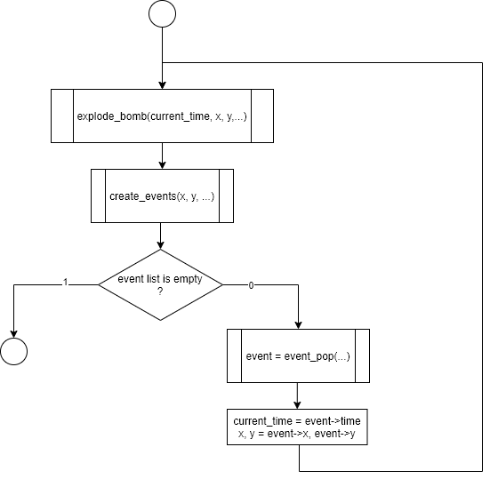

# 1. Introdução

## 1.1 Instruções

Na resolução deste projecto deve ser utilizada a Linguagem de Programação C. Para além da correta implementação dos requisitos, tenha em conta os seguintes aspetos:
- O código apresentado deve estar *bem indentado*. 
- O código deve compilar sem erros ou *warnings* utilizando o *gcc* com as seguintes flags:
 `-Wall -Wextra -Wpedantic -ansi`
- Tenha em atenção os nomes dados das variáveis, para que sejam indicadores daquilo que as mesmas vão conter.
- Evite o uso de constantes mágicas. 
- Evite duplicação de código. 
- Considere a implementação de funções para melhorar a legibilidade, evitar a duplicação e criar soluções mais genéricas.
- É proíbida a utilização de variáveis globais - i.e. variáveis declaradas fora de qualquer função.
- É proíbida a utilização da função `strtok()`.
- Este trabalho deverá ser realizado individualmente.

Para a realização deste projecto, os alunos deverão adquirir as seguintes competências:
- Manipulação de ficheiros
- Vectores e matrizes
- Strings
- Ciclos
- Condições
- Argumentos do main
- Estruturas
- Memória Dinâmica

## 1.2 Descrição

Pretende desenvolver-se um simulador capaz de calcular a propagação da explosão de bombas considerando a distância entre elas. As bombas podem ter dois estados, armed ou off.

Após o carregamento/construção do mapa, se o utilizador escolher a opção "propagate", a bomba seleccionada deverá explodir. Essa explosão será propagada para as bombas adjacentes e fará com que estas também explodam:

* A bomba que estiver em cima deverá explodir 10ms depois.
* A bomba que estiver na diagonal esquerda e em cima, deverá explodir 11ms depois.
* A bomba que estiver à esquerda deverá explodir 12ms depois.
* A bomba que estiver na diagonal esquerda e em baixo, deverá explodir 13ms depois.
* A bomba que estiver em baixo deverá explodir 14ms depois.
* A bomba que estiver na diagonal direita e em baixo, deverá explodir 15ms depois.
* A bomba que estiver à direita deverá explodir 16ms depois.
* A bomba que estiver na diagonal direita e em cima, deverá explodir 17ms depois.

  

Essas explosões irão por sua vez gerar novas explosões.

Depedentendo da opção escolhida pelo utilizador, o programa deverá apresentar, a cada explosão, o mapa completo, ou em alternativa deverá apresentar o tempo e a coordenada da bomba que explodiu. Para este efeito o comando trigger implementado no MiniProjecto dará lugar a dois comandos:

propagate <x> <y> - com esta opção se houver uma bomba na coordenada especificada, esta irá explodir e desencadear explosões sucessivas nas bombas adjacentes até que não haja mais bombas adjacentes. O programa para cada explosão deverá mostrar o mapa no ecrã.

log <x> <y> - com esta opção se houver uma bomba na coordenada especificada, esta irá explodir e desencadear explosões sucessivas nas bombas adjacentes até que não haja mais bombas adjacentes. O programa para cada explosão deverá mostrar no ecrã o tempo e a coordenada da bomba que explodiu. No caso de se executar mais que uma instrução de `propagate` no mesmo mapa, a segunda instrução deverá começar a contar o tempo no instante em que a primeira instrução de `propagate` terminou. E.g. se a última bomba da primeira instrução de propagate rebentou no instante 50, a primeira bomba do segundo `propagate` deverá rebentar no instante 50 também.

## 1.3 Projecto de Recurso
Esta versão do projecto considera também os casos em que ocorrem explosões em simultâneo. Quando um caso desses ocorre o programa deverá explodir as bombas por ordem de coordenada. Bomba com coordenada x mais pequena explode primeiro. Caso a coordenada X seja igual, a bomba com a coordenada Y mais pequena, deverá explodir primeiro.

Nota 1: Haverá vários testes que incidem sobre esta funcionalidade e os testes sobre a parte "infraestrutural" do programa (leitura de ficheiros, gravação de ficheiros) serão obrigatórios. 

Nota 2: Será feita uma análise de semelhança de código contra os trabalhos entregues em Avaliação Contínua.
 
# 2 Implementação

O programa deverá ser capaz de ler um ficheiro de configuração contendo o mapa com a localização de uma série de minas, e deverá fornecer ao utilizador uma interface para fazer alterações ao mapa - adicionar novas minas ou explodir uma mina existente. As explosões irão desencadear explosões das minas que estiverem em qualquer das 8 posições adjacentes. 

Cada posição no mapa representa-se por duas coordenadas (X, Y). Estas coordenadas são valores inteiros e, nesta segunda fase *não há limite superior para o tamanho do tabuleiro*. O mapa deverá ser criado na zona de memória dinâmica. No mínimo, o mapa terá de conter 1 linha e 1 coluna.

Cada uma das coordenadas do mapa poderá estar vazia (sem bomba) ou ter uma bomba. Cada bomba poderá assumir apenas 2 estados, ou armed ou off. 



## 2.1 - Leitura do ficheiro

 A leitura do ficheiro deve ser a primeira acção feita pelo programa. O nome do ficheiro deverá ser passado pela linha de comandos. Ou seja, o programa deverá ser corrido com o comando:
 ```
 ./bombroad filename
 ```
O programa deverá ler o ficheiro com o nome `filename` e construir o mapa correspondente. 

A primeira linha do ficheiro deverá conter as dimensões do mapa com formato `DIMX DIMY`. Note que o mapa não precisa de ser quadrado. Sendo assim, a alocação da memória para guardar o mapa deverá ser realizada de forma dinâmica. Existem duas formas de alocar uma matriz dinamicamente:
 * Alocar um vector de DIMX x DIMY elementos e depois fazer o calculo do índice do vector a partir do índice desejado da matriz.
 * Alocar um vector de apontadores que corresponde às linhas e depois para cada elemento desse vector, alocar um outro vector que corresponderá à coluna.
 
O nome do ficheiro é obrigatório para que o programa arranque correctamente. Caso esse argumento não seja passado, o programa deverá terminar mostrando a mensagem: `Error: missing file name`.
 
 
 
## 2.1 Menu

O programa deverá começar por apresentar o seguinte menu:

```
+-----------------------------------------------------+
show                - show the mine map
propagate <x> <y>   - explode bomb at <x> <y>
log <x> <y>         - explode bomb at <x> <y>
plant <x> <y>       - place bomb at <x> <y>
export <filename>   - save file with current map
quit                - exit program
sos                 - show menu
+-----------------------------------------------------+
```

Sempre que o programa estiver à espera que o utilizador introduza um input, deverá imprimir, numa linha isolada, o caracter `>`. Se o utilizador introduzir um input inválido o programa deverá mostrar a mensagem `Invalid command!` e deverá continuar à espera que o utilizar introduza um input.


### 2.1.2 Opção `show`

Quando o utilizador introduz o texto `show`, o programa deverá apresentar o mapa no terminal. 

No terminal o caracter `.`  representa uma mina em estado armed e o caracter `*` representa uma bomba off. As posições do mapa que estao vazias representam-se utilizando o caracter ` _` (underscore).

Exemplo:

```
>show
_.*...___________________
____.____________________
___.__*__._______________
____.____._______________
_________._______________
__*..____._______________
____*.___*_______________
__.___.__________________
___.__*__________________
```

### 2.1.3 Opção `propagate`

Quando o utilizador introduz o texto `propagate`, seguido das coordenadas X e Y, o programa deverá alterar o estado da mina nas coordenadas X e Y de armed para off.

Se, as coordenadas passadas pelo utilizador não forem válidas, o programa deverá imprimir a mensagem `Error: invalid coordinate`.

Se, nas coordenadas passadas pelo utilizador, não existir uma bomba, o programa deverá imprimir a mensagem `Error: no bomb at specified coordinate`.

Se, nas coordenadas passadas pelo utilizador, existir uma bomba no estado off,  o programa deverá apenas continuar sem nenhuma mensagem de erro.

### 2.1.4 Opção `plant`

Quando o utilizador introduz o texto `plant`, seguido das coordenadas X e Y, o programa deverá colocar, nas coordenadas X e Y, uma mina em estado armed.

Se, as coordenadas passadas pelo utilizador não forem válidas, o programa deverá imprimir no stdout a mensagem `Error: invalid coordinate`.

Se, nas coordenadas passadas pelo utilizador, existir uma mina em estado `off`, o programa deverá alterar o seu estado para `armed`.

Se, nas coordenadas passadas pelo utilizador, existir uma mina no estado `armed`,  o programa deverá apenas continuar sem nenhuma mensagem de erro.

### 2.1.5 Opção `export`

Quando o utilizador introduz o texto `export` seguido do nome do ficheiro `filename`, o programa deverá criar um ficheiro novo, com o nome `filename`, contendo a informação do mapa. O ficheiro deverá conter a informação da localização de todas as minas e o seu estado.

O formato do ficheiro de output deverá ser o mesmo do ficheiro de input. É indiferente a ordem pela qual cada par de coordenadas é escrita no ficheiro, desde que o ficheiro respeite o formato de ficheiro input espeficicado.
 
### 2.1.6 Opção `quit`

O programa deverá simplesmente terminar com o **código 0**.

### 2.1.7 Opção `sos`
Apresenta de novo o menu com as opções.

### 2.2 Ficheiro de input

O programa deverá ler um ficheiro de input. Este ficheiro terá tipicamente a extensão `.ini`, contudo outras extensões poderão ser utilizadas.

Todas as linhas do ficheiro começadas pelo caracter `#` deverão ser ignoradas. *Linhas em branco também deverão ser ignoradas.*
A primeira linha útil (que não começa `#`) do ficheiro deverá conter o tamanho do mapa representado por dois interos:
```
25 25
```
Neste projecto, o tamanho do mapa **não é** fixo.

As linhas seguintes contém o estado, representado pelo caracter `.` ou `*`, seguido da localização da bomba. Cada linha pode apenas conter informação de uma bomba. Cada localização (coordenada) representa-se por um par de valores inteiros (X Y) separados por um espaço em branco (espaço ou tab), sendo X o número da linha e Y o número da coluna. Assim uma bomba em estado `armed` na coordenata 10 5 representa-se da seguinte forma:
```
. 10 5
```
Exemplo de ficheiro de input:
```
# Ficheiro exemplo
9 10
. 0 1
. 0 2
. 0 3
. 0 4
. 0 5
. 1 4
. 2 3
. 2 6
. 2 9
. 3 4
. 3 9
. 4 9
. 5 2
. 5 3
. 5 4
. 5 9
. 6 4
. 6 5
. 6 9
. 7 2
. 7 6
. 8 3
. 8 6
```

A leitura do ficheiro deverá ser realizada até detectar o fim do ficheiro. 

Caso não seja possível abrir o ficheiro, o programa deverá imprimir a mensagem `Error: could not open file` e em seguida deverá terminar.

 Se o tamanho do mapa for invalido, o programa deverá mostrar a mensagem `Error: invalid map dimensions` e em seguida deverá terminar.
 
Para cada bomba, deverá existir o estado, uma coordenada X e uma Y. Caso isso não se verifique, significa que o ficheiro está mal formatado. Nesse caso o programa deverá mostrar a mensagem `Error: File is corrupted` e deverá terminar. O caracter que separa o estado, a coordenada X e a coordenada Y poderá ser um espaço ou um tab, e todo o texto que apareça após a coodenada Y da bomba deverá ser simplesmente ignorado.

A mesma mensagem deverá ser mostrada caso alguma coordenada presente no ficheiro não seja válida (fora dos limites). Se isso acontecer, o programa deverá terminar.

Os alunos deverão criar os seus próprios ficheiros de input para testarem os seus programas. Ficheiros de input criados pelos alunos deverão ser entregues no moodle e serão sujeitos a avaliação. Os alunos deverão criar ficheiros de input válidos e inválidos para poderem testar correctamente os seus programas.


## 3. Implemetação
 
### 3.1 Mensagens de Erro e códigos de saída
**Atenção!** As mensagens de erro são diferentes das que foram utilizadas no mini projecto. Para facilitar a implementação, as mensagens de erro são fornecidas num header file -  que poderá ser incluído no código utiliando a directiva
 ```
 #include "messages.h"
 ```
 
 O programa deve sempre terminar com o código de retorno 0. O código de retorno do programa é o valor que a função  `main()` retorna. Alternativamente, podem utilizar a função `exit(0)` da biblioteca `stdlib.h` que permite terminar o programa fora da função da função `main()`.
  
### 3.2 - Simulação

Deverá ser criada uma lista de eventos. Cada explosão que ocorre irá gerar eventos que deverão ser colocados na lista. Esta lista deverá ser percorrida até que já não existam eventos. 

Cada evento está associado a um tempo, e a uma coordenada de uma bomba. (A implementação mais simples será utilizar uma estrutura.) A lista de eventos deverá ser implementada recorrendo a uma lista ligada em que a inserção na lista é feita de forma ordenada. Ou seja, quando um evento é criado, ele é colocado na lista de forma ordenada, e assim a primeira posição da lista é sempre o evento com menor `t`.

O seguinte fluxograma apresenta uma possível implementação:
 


## 4. Opção Extra
Se o programa for corrido com a opção `-a` (como argumento do main) deverá ser utilizada a biblioteca ncurses.h para apresentação do mapa e do menu do programa. Esta opção não 
será avaliada pelo PANDORA.

Um exemplo de funcionamento utilizando a biblioteca ncurses pode ser visualizado no vídeo https://youtu.be/xb7Y4He2tvA.
 

## 5.  Exemplo de utilização

### 5.1. Exemplo opção log
```bash
./bombroad map0.ini
+-----------------------------------------------------+
show                - show the mine map
propagate <x> <y>   - explode bomb at <x> <y>
log <x> <y>         - explode bomb at <x> <y>
plant <x> <y>       - place bomb at <x> <y>
export <filename>   - save file with current map
quit                - exit program
sos                 - show menu
+-----------------------------------------------------+
>log 2 9
0 [2, 9]
14 [3, 9]
28 [4, 9]
42 [5, 9]
56 [6, 9]
>show
_.....____
____._____
___.__.__*
____.____*
_________*
__...____*
____..___*
__.___.___
___.__.___
>quit
```

```bash
./bombroad map0.ini
+-----------------------------------------------------+
show                - show the mine map
propagate <x> <y>   - explode bomb at <x> <y>
log <x> <y>         - explode bomb at <x> <y>
plant <x> <y>       - place bomb at <x> <y>
export <filename>   - save file with current map
quit                - exit program
sos                 - show menu
+-----------------------------------------------------+
>log 0 1
0 [0, 1]
16 [0, 2]
32 [0, 3]
47 [1, 4]
48 [0, 4]
60 [2, 3]
64 [0, 5]
75 [3, 4]
>show
_*****____
____*_____
___*__.__.
____*____.
_________.
__...____.
____..___.
__.___.___
___.__.___
>
```
 
## 6. Material a entregar

* Ficheiro `.c` com código devidamente comentado e indentado:
    - Deve implementar as funcionalidades pedidas.
    - O código deverá ser submetido na plataforma PANDORA [(2)](#ref2)
    - A plataforma corre automaticamente uma série de testes e no fim atribui uma classificação **indicativa**. Os alunos deverão analisar o relatório emitido pela plataforma e poderão alterar o código e voltar a submeter o trabalho. Neste trabalho haverá limite de submissões.
      A plataforma não permite a entrega de trabalhos após a data e hora limite.
    - Incorrecta indentação do código poderá originar penalizações na nota.

### 6.1 Datas (Projecto Final)
    - O código deverá ser submetido na plataforma PANDORA [(2)](#ref2) até às **23:59 do dia 28 de Junho de 2021** no *contest* **LP12021PF**.

### 6.2 Datas (Projecto de Recurso)
    - O código deverá ser submetido na plataforma PANDORA [(2)](#ref2) até às **23:59 do dia 16 de Julho de 2021** no *contest* **LP12021PR**.

### 6.3 Datas (Projecto de Época Especial)
    - O código deverá ser submetido na plataforma PANDORA [(2)](#ref2) até às **23:59 do dia 14 de Setembro de 2021** no *contest* **LP12021PR**.
 

## 7. Peso na avaliação

O projecto final vale 20% da nota final e será cotado de 0 a 20 valores.

O projecto de recurso e de época especial valem 50% da nota final e será cotado de 0 a 20 valores.
 
A nota indicada pelo pandora é apenas indicativa. O código será posteriormente comparado e avaliado pelos docentes.

Após a entrega do projecto será realizada uma defesa do projecto onde cada elemento do grupo terá de efectuar alterações ao código. Se o aluno não conseguir efectuar as alterações pedidas ao seu código será aplicada uma penalização sobre a nota do projecto que poderá variar entre 10% a 100%.
 
Este projecto tem nota mínima.

## 8. Honestidade Académica

Nesta disciplina, espera-se que cada aluno siga os mais altos padrões de honestidade académica. Trabalhos que sejam identificados como cópias serão anulados e os alunos envolvidos terão nota zero - quer tenham copiado, quer tenham deixado copiar.
Para evitar situações deste género, recomendamos aos alunos que nunca partilhem ou mostrem o seu código.
A decisão sobre se um trabalho é uma cópia cabe exclusivamente aos docentes da unidade curricular.
Os alunos são encorajados a discutir os problemas com outros alunos mas não deverão, no entanto, copiar códigos, documentação e relatórios de outros alunos. Em nenhuma circunstância deverão partilhar os seus próprios códigos, documentação e relatórios. De facto, não devem sequer deixar códigos, documentação e relatórios em computadores de uso partilhado.

## Referências

<a name="ref1"></a>

* (1) Pereira, A. (2017). C e Algoritmos, 2ª edição. Sílabo.

<a name="ref2"></a>

* (2)  PANDORA - Yet Another Automated Assessment Tool, https://saturn.ulusofona.pt/.

<a name="ref3"></a>

* (3)  Lusófona Moodle, https://secure.grupolusofona.pt/ulht/moodle/

## Metadados

* Autor: [Pedro Serra]
* Curso:  [Licenciatura em Videojogos]
* Instituição: [Universidade Lusófona de Humanidades e Tecnologias][ULHT]
